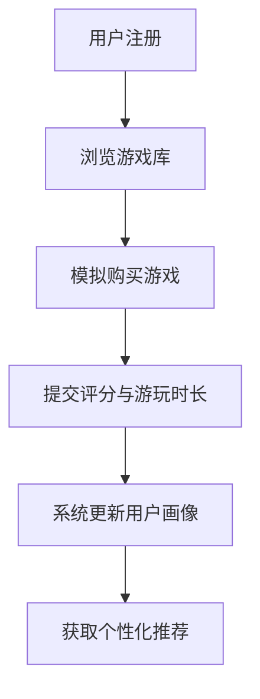
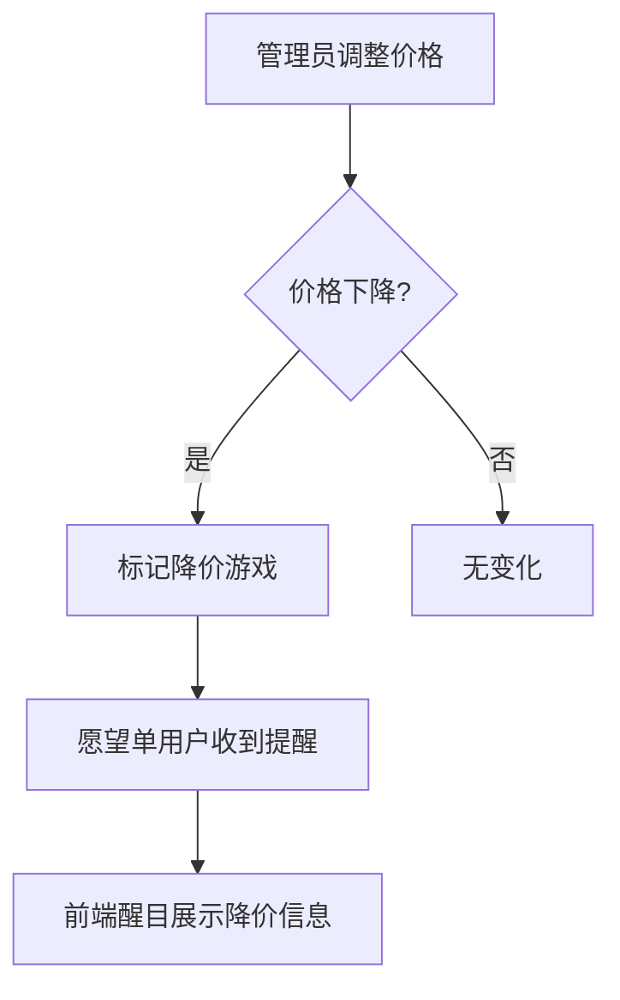

# 产品需求文档 (PRD)

## 1. 产品概述

智荐优游是一款基于协同过滤算法的Steam游戏促销个性化推荐与愿望单降价提醒系统演示平台。系统通过分析用户的游戏购买行为、评分和游玩时长，结合混合推荐算法，为用户精准推荐正在促销且符合其偏好的游戏，同时提供愿望单价格监控和降价提醒功能。

- **目标用户**：Steam游戏玩家、寻找优惠游戏的用户
- **核心价值**：帮助用户在海量Steam游戏中发现感兴趣的促销游戏，省钱省时

---

## 2. 核心功能

### 2.1 用户角色

| 角色 | 注册方式 | 核心权限 |
|------|----------|----------|
| 普通用户 | 邮箱注册/登录 | 浏览游戏、评分、推荐、愿望单管理 |
| 管理员 | 系统预设账号 | 价格管理、促销游戏管理 |

### 2.2 功能模块

1. **首页/推荐页**：展示个性化推荐游戏列表（促销中）
2. **游戏详情页**：展示游戏信息、用户评分、添加愿望单
3. **愿望单页**：管理个人愿望单、显示降价状态
4. **评分页**：对已购买游戏提交评分与游玩时长
5. **管理后台**：管理员随机调整游戏价格、触发降价提醒

---

## 3. 核心流程

### 3.1 用户注册与评分流程

### 3.2 降价提醒流程

---

## 4. 推荐算法说明

### 4.1 混合推荐算法

采用**协同过滤 + 游玩时长权重**的混合推荐方式：

1. **基于用户的协同过滤**：计算用户之间的相似度（余弦相似度），推荐相似用户喜欢的游戏
2. **游玩时长权重**：游玩时长越长的游戏，对用户偏好的贡献越大
3. **混合方式**：加权融合两类评分，公式：`最终评分 = 0.6 × 协同过滤评分 + 0.4 × 时长权重评分`
4. **促销筛选**：仅推荐当前处于促销状态的

---

## 5. 用户界面设计

### 5.1 设计风格

- **主题**：深色赛博朋克风格，契合Steam游戏平台氛围
- **主色调**：深蓝紫渐变背景 (#0f0f23 → #1a1a3e)
- **强调色**：霓虹紫 (#8b5cf6)、霓虹蓝 (#3b82f6)
- **按钮风格**：圆角渐变按钮，带发光效果
- **字体**：Orbitron (标题) + Inter (正文)
- **布局**：卡片式布局，响应式网格

### 5.2 页面设计概览

| 页面 | 模块 | UI元素 |
|------|------|--------|
| 首页 | Hero区 | 大标题、渐变背景、动态粒子效果 |
| 首页 | 推荐游戏列表 | 卡片网格、游戏封面、折扣标签、价格信息 |
| 游戏详情 | 游戏信息卡 | 封面、描述、评分、愿望单按钮 |
| 愿望单 | 降价提醒横幅 | 红色闪烁边框、价格对比动画 |
| 管理后台 | 价格调整面板 | 滑块、随机按钮、确认操作 |

### 5.3 响应式设计

- **桌面端 (≥1024px)**：3-4列游戏卡片网格
- **平板端 (768px-1023px)**：2-3列网格
- **手机端 (<768px)**：单列布局，底部导航

---

## 6. 数据结构

### 6.1 模拟数据结构

- **用户数据**：id、用户名、邮箱、密码（哈希）
- **游戏数据**：id、名称、描述、原价、促销价、封面图、标签
- **评分数据**：userId、gameId、评分(1-5)、游玩时长(小时)
- **愿望单数据**：userId、gameId、添加时间、原始价格、当前价格

### 6.2 初始数据

预置20+款Steam热门游戏模拟数据，包括：
- 《赛博朋克2077》、《巫师3》、《艾尔登法环》等3A大作
- 《吸血鬼幸存者》、《哈迪斯》等独立游戏
- 涵盖RPG、动作、冒险、策略等类型

---

## 7. 技术约束

- **前端框架**：React 18 + TypeScript + Vite
- **状态管理**：Zustand
- **样式方案**：TailwindCSS + 自定义CSS动画
- **路由**：React Router v6
- **图标**：Lucide React
- **数据**：纯前端模拟数据，无需后端
